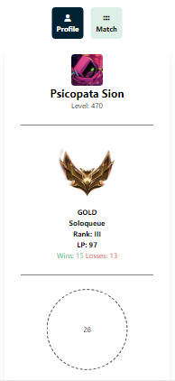
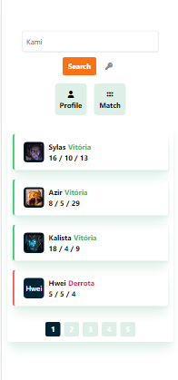

# Api Riot App

## Capturas de tela

- Perfil

- Partidas

# Rodando localmente

- Utilize um Servidor Local, ex: XAMPP
- Acesse a <a href="https://developer.riotgames.com/">Riot Developer</a> e crie uma conta
- Gere um token para utilizar no projeto

Aproveite :)
